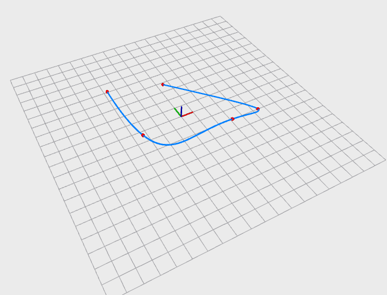
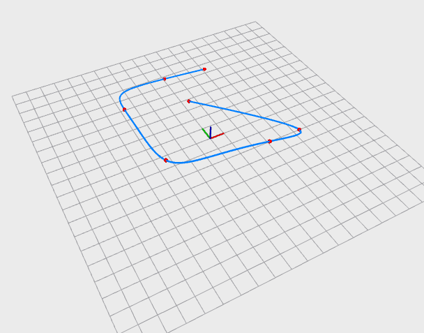

# 移动机器人运动规划
深蓝学院课程作业:
[移动机器人的运动规划](https://www.shenlanxueyuan.com/course/484)
## HW1
主要是环境配置
```shell
source devel/setup.bash
roslaunch grid_path_searcher demo.launch
```
运行后在rviz中就会出现


## HW2
实现A*和JPS算法
```shell
source devel/setup.bash
roslaunch grid_path_searcher demo.launch
```

实现A*算法，其中启发函数是Euclidean
实现JPS算法

主函数在demo_node.cpp
具体使用哪个算法，需要在demo_node.cpp里选择
```c++
//_use_jps = 0 -> Do not use JPS
//_use_jps = 1 -> Use JPS
//you just need to change the #define value of _use_jps
#define _use_jps 1
#if _use_jps
```

<!--  -->

A*流程和JPS流程相似：


<!--  -->

核心代码的实现在
```c++
void AstarPathFinder::AstarGraphSearch(Vector3d start_pt, Vector3d end_pt)
``` 

## HW3
rrt*算法
TODO

## HW4
OBVP问题


最后化简到cost function仅与参数T相关，仅需对T作优化即可。

表达式的化简工作由syspy完成，见脚本test_syspy.ipynb


## HW5
BIVP问题，生成minimum jerk曲线

程序运行：
```shell
roslaunch lec5_hw click_gen.launch
```



OBVP求解过程可见论文minco,s=3的情形，实现代码见：
```
void minimumJerkTrajGen()
``` 


## HW6
MPC 模型预测控制

曲线跟踪
## HOW TO RUN
```
./install_tools.sh
catkin_make -j1
source devel/setup.zsh
roslaunch mpc_car simulation.launch
```
### HOW TO TURN PARAMETERS
```
./src/mpc_car/config/mpc_car.yaml -> mpc parameters
./src/car_simulator/config/car_simulator.yaml -> initial states (in simulation)
```

### Homework1
> Implement MPC of tracking the reference trajectory in C++;
> 
> using osqp

$min  J = \sum_{i=0}^N (x-x_r)^2+ (y-y_r)^2 + \rho * (\phi-\phi_r)^2$
 
$s.t. -0.1 <= v_k <= v_{max}\\
     |a_k| <= a_{max}\\
     |\delta_k| <= \delta_{max}\\
     |\delta_{k+1} - \delta_k| <= d\delta_{max}$ 

### Homework2
> Implement MPC with delays in C++;

using runge kutta-4 ： 参考[四阶龙格库塔法](https://zhuanlan.zhihu.com/p/427409568?utm_oi=1216413085835370496):
```c++
  inline void step(VectorX& state, const VectorU& input, const double dt) const {
    // Runge–Kutta

    // fourth-order Runge-Kutta
    VectorX k1 = diff(state, input);
    VectorX k2 = diff(state + k1 * dt / 2, input);
    VectorX k3 = diff(state + k2 * dt / 2, input);
    VectorX k4 = diff(state + k3 * dt, input);
    state = state + (k1 + k2 * 2 + k3 * 2 + k4) * dt / 6;
  }
```
### Homework3 (optional)
> Implement MPCC in C++;
> 
>TODO


__[ATTENTION]__ Only <TODO: > of codes in src/mpc_car/include/mpc_car/mpc_car.hpp is required.

## AN EXAMPLE
>
<p align="center">
    
</p>

## FINAL PROJECT
该项目为深蓝学院"移动机器人运动规划"课程大作业。大作业涉及如下方面：

* 路径搜索
* 轨迹生成
* 轨迹重优化
* 由传感器范围有限所导致的重规划

### premitives

安装系统依赖
```
sudo apt-get install cmake libopenblas-dev liblapack-dev libarpack-dev libarpack2-dev libsuperlu-dev
```

安装Armadillo
```
xz -d armadillo-9.870.2.tar.xz
tar -xvf armadillo-9.870.2.tar
cd armadillo-9.870.2
mkdir build
cd build
cmake ..
make
sudo make install
```
### 功能包介绍

* random_complex：随机生成障碍物点云地图；
* waypoint_generator：给定目标点；
* odom_visualization：四旋翼可视化；
* pcl_render_node：简单版的局部传感器模型，返回局部范围内的障碍物点云；
* **trajectory_generator_node** ：大作业核心部分，生成一条可行的多项式轨迹；
* traj_server：将多项式轨迹转换为控制指令；
* so3_control：将控制指令转换为实际控制量；
* quadrotor_simulator_so3：无人机仿真模型。

### 任务

1. 阅读代码：画出trajectory_generator_node运行流程图，重点是厘清
   1. 几个状态之间的切换过程；
   ```c++
    string state_str[5] = {"INIT", "WAIT_TARGET", "GEN_NEW_TRAJ", "EXEC_TRAJ",
                         "REPLAN_TRAJ"};
    //状态切换见:trajectory_generator_node.cpp
    void execCallback(const ros::TimerEvent &e);
   ```
   2. 各个主要功能之间的调用关系，不需要深入到各个功能的内部例如A*的流程。
2. path planning：推荐实现方案为A*，也可采用其他方案；
3. simplify the path：将整条path简化为少数几个关键waypoints，推荐方案为RDP算法；
4. trajectory optimization：推荐实现方案为minimum snap trajectory generation，也可采用其他方案；
5. safe checking: 验证生成的轨迹是否安全；
6. trajectory reoptimization：此环节只针对使用minimum snap trajectory generation的时候。由于该方法只对连续性进行优化，并不能保证优化后的轨迹不会撞上障碍物，所以需要对撞上障碍物的部分重优化。推荐方法详见文献：["Polynomial Trajectory Planning for Aggressive Quadrotor Flight in Dense Indoor Environments" part 3.5](https://dspace.mit.edu/bitstream/handle/1721.1/106840/Roy_Polynomial%20trajectory.pdf?sequence=1&isAllowed=y)。

#### RDP算法

伪代码（来源：[维基百科](https://en.wikipedia.org/wiki/Ramer–Douglas–Peucker_algorithm)）：

```
function DouglasPeucker(PointList[], epsilon)
    // Find the point with the maximum distance
    dmax = 0
    index = 0
    end = length(PointList)
    for i = 2 to (end - 1) {
        d = perpendicularDistance(PointList[i], Line(PointList[1], PointList[end])) 
        if (d > dmax) {
            index = i
            dmax = d
        }
    }
    
    ResultList[] = empty;
    
    // If max distance is greater than epsilon, recursively simplify
    if (dmax > epsilon) {
        // Recursive call
        recResults1[] = DouglasPeucker(PointList[1...index], epsilon)
        recResults2[] = DouglasPeucker(PointList[index...end], epsilon)

        // Build the result list
        ResultList[] = {recResults1[1...length(recResults1) - 1], recResults2[1...length(recResults2)]}
    } else {
        ResultList[] = {PointList[1], PointList[end]}
    }
    // Return the result
    return ResultList[]
end
```

### 代码运行
```
source devel/setup.bash
roslaunch trajectory_generator demo.launch
```
<p align="center">
    
</p>


# 机器人学中的数值优化
深蓝学院课程作业:
[机器人学中的数值优化](https://www.shenlanxueyuan.com/course/490?source=1)
## OPTIM_HW1
use Armijo condition to solve the Rosenbrock function:

$f(\mathbf{x})=f(x_1,x_2,\ldots,x_N)=\sum_{i=1}^{N/2}\left[100\left(x_{2i-1}^2-x_{2i}\right)^2+\left(x_{2i-1}-1\right)^2\right]$

## OPTIM_HW2

Implement smooth trajectory generation by C++ , using l-bfgs

```shell 
source devel/setup.bash
roslaunch gcopter curve_gen.launch 
```

<p align="center">
    
</p>